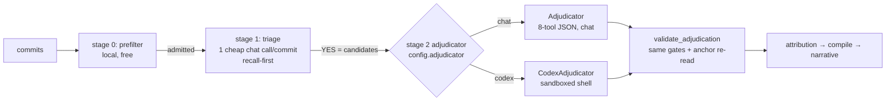
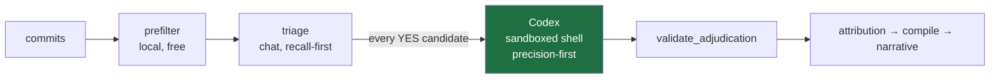

# Dropping the intermediate chat stage: triage → Codex

*Design note. Proposes making Codex the stage-2 backend directly behind triage,
and explains why the "chat proposes → Codex confirms" cascade should stay an
evaluation tool rather than become the production pipeline.*

## TL;DR

Your instinct is right, with one clarification that makes the change smaller
than it looks:

- The production `scan` pipeline is **already two model stages**: triage (one
  cheap chat call per commit) → **one** stage-2 adjudicator. When you pass
  `--adjudicator codex`, it already runs **triage(chat) → Codex** with *no*
  intermediate chat adjudication.
- The three-stage flow you remember — *chat filters, chat adjudicates, then
  Codex* — exists today **only as an evaluation simulation**
  (`scripts/ab_adjudicator.py::cascade`), not in `scan.py`. `scan.py` picks
  chat **xor** codex for stage 2; it never chains them.
- So "keep the initial chat call, then continue straight to Codex" means:
  **make Codex the stage-2 backend and do not promote the chat-proposer cascade
  into production.** That is a good default on precision and recall; the only
  thing it costs you is the chat proposer's role as a cheap way to shrink
  Codex's workload.

Recommendation: **adopt triage → Codex as the intended production shape.** Keep
the chat adjudicator as a fallback / cheap mode / eval baseline, not as a
mandatory middle stage. Measure cost at your real candidate rate before flipping
the CLI default (see [What to measure](#what-to-measure-before-flipping-the-default)).

## Current architecture (as built)

Two model stages sit behind two free local gates. The cost model names this a
"two-pass cascade" explicitly
(`strata_eval.metrics.expected_cascade_cost`, "Expected cost per commit for the
two-pass cascade").



Key facts, with references:

- **Stage 2 is mutually exclusive.** `scan_repository` builds *either* a
  `CodexAdjudicator` *or* an `Adjudicator`, never both
  (`src/strata/scan.py:277-287`). There is no code path in production that runs
  chat adjudication and then Codex.
- **Triage is the "first chat call" that filters relevant commits.** One
  `max_tokens`-bounded chat completion per admitted commit, tuned for recall
  (`src/strata/scan.py:220-267`, `OpenAICompatibleTriageBackend` in
  `src/strata/triage.py:541-601`). Its output (`triage_yes`) is the candidate
  set stage 2 consumes.
- **The validator is shared.** Whatever answers stage 2, the finding goes
  through the same `validate_adjudication` — the same reachability/containment
  gates, the same byte-for-byte anchor re-read against git
  (`src/strata/codex_adjudicator.py:596-618`). Codex only changes *how the model
  investigates*, never *how a finding is validated*.
- **The base rates that dictate the shape.** ~1.5% prevalence, so stage 1 is
  recall-first and stage 2 — which only ever sees survivors — does the precision
  work and "can afford 30-100x the per-commit spend" (`src/strata/scan.py:3-7`).

### Where the "chat again → then Codex" actually lives

`scripts/ab_adjudicator.py::cascade` (`:251-303`) simulates a *third* stage over
**pre-computed** results: one backend is the **proposer**, the other the
**confirmer**. A candidate is emitted only when the proposer says YES **and**
the confirmer keeps it, under one of two rules:

- **strict** — the confirmer must also say YES. Maximum precision; *every
  abstention the confirmer makes costs a true positive.*
- **veto** — the confirmer only has to not say NO.

That is the "chat proposes, Codex confirms" cascade. It is a measurement device
— it composes two independent runs for free to ask *"would stacking them help?"*
— not a wired pipeline. Nothing in `scan.py` or the importer runs it.

## The proposal: triage(chat) → Codex



Codex adjudicates **every** triage survivor directly. No chat adjudicator gates
the set first.

### Why this is the right default

1. **Codex is the stronger adjudicator by design.** It exists precisely to
   answer containment and reachability *by looking rather than by inference* —
   it can list a directory, follow a call graph, and run `git log -S`, which the
   eight-tool chat backend cannot (`src/strata/codex_adjudicator.py:1-27`).

2. **A proposer→confirmer cascade caps recall at the *proposer's* recall.** If
   the chat adjudicator sits in front of Codex, any real fix chat misses
   (NO/ABSTAIN) never reaches Codex — chat's blind spots become the whole
   system's ceiling. And chat is measurably weaker on the decisive gate: the
   reachability instruction that *helps* Codex *hurts* chat, "given only a diff
   it removes the reachability test instead of correcting it (measured: 78%/78%
   -> 63%/74% on chat)" (`src/strata/codex_adjudicator.py:256-258`). Putting the
   weaker model in the gating position is the wrong way round.

3. **Triage already does the narrowing the chat proposer would.** The prefilter
   (free) plus a recall-first triage call are the two big funnel steps. The
   chat proposer as a *third* filter mostly buys cost control, not accuracy —
   and it does so by risking recall (point 2).

4. **Simplicity and provenance.** One stage-2 backend means one prompt id, one
   audit trail, one set of failure modes to reason about. A cascade would need a
   composite verdict, a merged cost/latency record, and a policy for
   proposer-YES / confirmer-ABSTAIN disagreements.

### What you give up — and how to cover it

The one real loss is **cost and latency control**:

- Codex is roughly **6x the latency per candidate** of chat
  (`src/strata/__main__.py:266-268`) and sits at the expensive end of the
  "30-100x per-commit spend" band. Removing the chat proposer means Codex runs
  on the *full* triage-YES set instead of the chat-approved subset.

Mitigations already in the codebase, no new machinery required:

- **`--max-candidates`** caps how many adjudications run
  (`src/strata/scan.py:270-275`).
- **`--max-cost`** stops adjudication when the estimated spend hits a ceiling
  (`src/strata/scan.py:318-325`).
- **Keep the chat backend available as an optional cheap pre-filter**, run in
  **veto** mode (Codex only skipped when chat is confidently NO) rather than
  strict mode — this preserves most recall while still trimming Codex load.
  That is a *config choice*, not the default.
- **Tune triage recall/precision** — the profile knob (`triage_profile`) is the
  cheapest lever on how many candidates reach Codex.

## What changes in the code

The change is deliberately small because the plumbing already exists.

| Area | File | Change |
| --- | --- | --- |
| Stage-2 selection | `src/strata/scan.py:277-287` | No structural change — already `codex` xor `chat`. Optionally make `codex` the default `ScanConfig.adjudicator`, and reword the docstring (`:72-80`) so it stops implying the choice is only about the investigation layer. |
| CLI default + help | `src/strata/__main__.py:258-269` | Optionally flip `--adjudicator` default to `codex`; clarify help that codex is the recommended stage-2 and chat is the cheap/fallback mode. |
| Chat adjudicator | `src/strata/adjudicator.py` | **Keep.** It is the A/B baseline, the graceful-degradation path when `codex_available()` is false, and the cheap mode. Do not delete. |
| Codex availability fallback | `src/strata/scan.py:277-285` | Consider: if `adjudicator="codex"` but `codex_available()` is false, fall back to chat with a loud progress line instead of raising, so a scan never dies for want of the runtime. |
| Optional veto pre-filter | *(new, optional)* | If you want the cost lever, a thin `VetoAdjudicator(cheap, expensive)` wrapper: run chat; only call Codex when chat is not a confident NO. Wraps any `adjudicate(candidate)`, same as `ConsensusAdjudicator` does. |
| Tests | `tests/test_strata_codex_adjudicator.py`, scan tests | Contract/validator tests are unchanged (same `validate_adjudication`, same schema). Only default-selection assertions move if you flip the CLI default. |
| Eval | `scripts/ab_adjudicator.py::cascade` | **Keep as-is.** It is exactly the tool that justifies this decision — run it to get real strict/veto numbers before changing the default. |

### The alternative we are *not* taking

Promoting the three-stage cascade (chat proposer + Codex confirmer) into
`scan.py`. That would mean a new `CascadeAdjudicator` composing two backends per
candidate, a merged provenance/cost record, and a disagreement policy. It adds
latency (two model stages per candidate, not one), adds the recall cap from
point 2, and adds complexity — in exchange for precision the shared validator
gates already deliver. Rejected unless the A/B numbers below show the cascade
beating Codex-alone on precision *without* a recall cost you're willing to pay.

## What to measure before flipping the default

The `ab_adjudicator` harness answers all of this against the frozen truth set,
offline, cheaply (`scripts/ab_adjudicator.py`):

```bash
# 1. The two backends head to head on the truth fixture
uv run python -m scripts.ab_adjudicator --backend chat  --out results/ab/chat.json
uv run python -m scripts.ab_adjudicator --backend codex --out results/ab/codex.json
uv run python -m scripts.ab_adjudicator --compare results/ab/chat.json results/ab/codex.json

# 2. Would the cascade actually beat codex-alone? (strict vs veto)
uv run python -m scripts.ab_adjudicator --cascade results/ab/chat.json results/ab/codex.json
```

Decision inputs:

1. **Precision / recall / abstain** for codex-alone vs chat-alone vs the
   cascade (strict and veto). If codex-alone's recall ≥ the cascade's and its
   precision is acceptable, the middle stage is pure cost with no benefit —
   drop it.
2. **Expected $/commit** at your real triage-YES rate, via
   `strata_eval.metrics.expected_cascade_cost` (`:187-196`) — plug in
   `triage_cost_per_commit`, `adjudicator_cost_per_candidate` (Codex), and the
   observed `candidate_rate`. This tells you what codex-on-every-candidate costs
   per 1,000 commits and whether `--max-cost` / veto mode is needed at scale.
3. **Latency budget.** Codex ≈ 6x chat per candidate. Confirm the full
   triage-YES set fits your wall-clock target, or bound it with
   `--max-candidates` / `workers`.

## Open questions for you

1. **Default or opt-in?** Should `--adjudicator codex` become the default, or
   stay opt-in with chat as default until the cost numbers are in?
2. **Cost at scale.** Is codex-on-every-triage-survivor acceptable for your
   target repos, or do you want the veto pre-filter kept as a lever?
3. **Fate of the chat adjudicator.** Fallback-only (when Codex is unavailable)?
   Cheap-mode? Or eval-baseline-only? My recommendation is all three — keep it,
   demote it.
